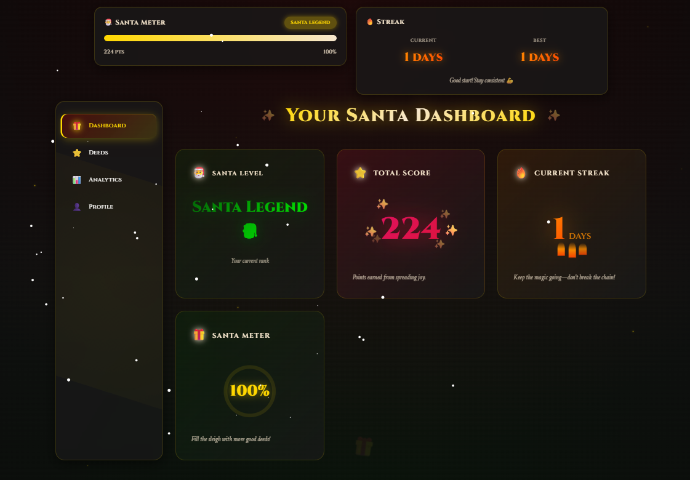
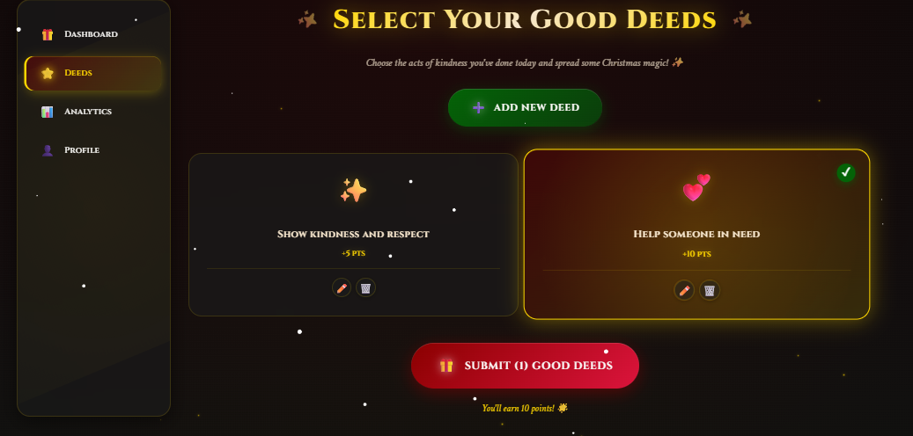
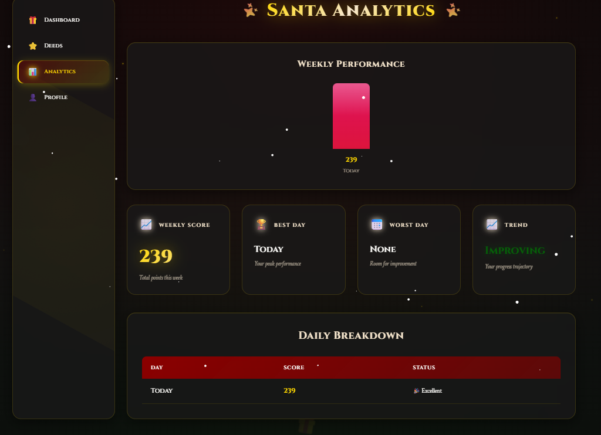
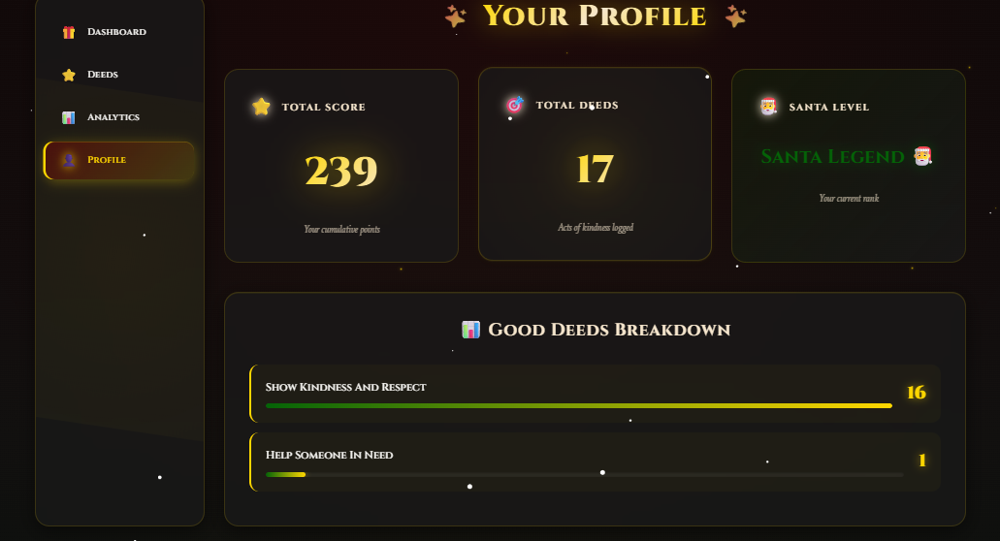

# SantaVerse – Intelligent Good Deeds & Impact Platform

> A behavior-analysis and gamified productivity platform built for the "Santa-ക്ക് ഒരു App" hackathon by Brototype Student Excellence Team.

## 🎯 Project Overview

**SantaVerse** is not a simple checklist application. It is an intelligent behavior-tracking and gamification platform that goes beyond task completion to analyze user patterns, motivate consistent positive behavior, and provide meaningful insights into personal growth and impact.

Unlike traditional to-do apps that simply mark tasks as complete, SantaVerse employs a **weighted scoring algorithm**, **streak-based consistency tracking**, and **adaptive Santa feedback** to create a comprehensive personal development system disguised as a festive experience.

### Built For
**"Santa-ക്ക് ഒരു App" Online Hackathon**  
Organized by: Brototype Student Excellence Team  
Status: Original project created exclusively for this hackathon

---

## 🏆 What Makes This Innovative

| Traditional Checklist Apps | SantaVerse |
|---------------------------|------------|
| Simple task completion | Weighted impact scoring based on deed type |
| Binary done/not-done | Multi-factor analysis (impact, difficulty, consistency) |
| No behavioral insights | Comprehensive analytics with trend detection |
| Static rewards | Dynamic Santa levels with progression system |
| No consistency tracking | Intelligent streak system with recovery logic |
| Generic feedback | Context-aware Santa messages based on performance |

**Key Differentiator**: SantaVerse treats personal development as a continuous journey, not a checklist. The platform analyzes **what** you do, **how often** you do it, and **how consistently** you maintain positive behaviors.

---

## 🛠️ Tech Stack

- **Frontend Framework**: React (Vite)
- **Language**: JavaScript (ES6+)
- **Styling**: Custom CSS with glassmorphism effects and animations
- **Storage**: LocalStorage with abstraction layer (migration-ready architecture)
- **Architecture Pattern**: MVC-inspired clean architecture
- **Build Tool**: Vite (fast development and optimized builds)

---

## 🏗️ Architecture

SantaVerse follows a **layered MVC-inspired architecture** for maintainability, testability, and scalability.
```
┌─────────────────────────────────────────┐
│            UI Layer (Views)             │
│  Dashboard, Deeds, Analytics, Profile   │
└────────────────┬────────────────────────┘
                 │
┌────────────────▼────────────────────────┐
│          Controllers Layer              │
│   Route handlers & UI orchestration     │
└────────────────┬────────────────────────┘
                 │
┌────────────────▼────────────────────────┐
│          Services Layer                 │
│  Business logic & scoring algorithms    │
└────────────────┬────────────────────────┘
                 │
┌────────────────▼────────────────────────┐
│          Models Layer                   │
│   Data structures & validation          │
└────────────────┬────────────────────────┘
                 │
┌────────────────▼────────────────────────┐
│          Storage Layer                  │
│    Persistence abstraction (localStorage)│
└─────────────────────────────────────────┘
```

### Data Flow Example
1. User adds a new good deed (View)
2. Controller validates input and calls DeedService
3. DeedService calculates impact score using weighted algorithm
4. Model structures the deed data
5. Storage layer persists to localStorage
6. Santa Meter updates based on new score
7. Analytics service recalculates weekly trends
8. UI re-renders with updated state

---

## 📁 Project Structure
```
src/
├── models/           # Data structures and schemas
│   ├── Deed.js       # Deed entity with validation
│   └── User.js       # User profile model
│
├── controllers/      # Route handlers and UI orchestration
│   ├── DeedController.js
│   ├── AnalyticsController.js
│   └── ProfileController.js
│
├── services/         # Business logic layer
│   ├── SantaScoringService.js    # Weighted scoring algorithm
│   ├── StreakService.js          # Consistency tracking
│   ├── AnalyticsService.js       # Performance calculations
│   └── SantaMessageService.js    # Dynamic feedback generation
│
├── views/            # Page-level components
│   ├── Dashboard.jsx
│   ├── DeedsPage.jsx
│   ├── AnalyticsPage.jsx
│   └── ProfilePage.jsx
│
├── components/       # Reusable UI components
│   ├── SantaMeter.jsx
│   ├── DeedCard.jsx
│   ├── StreakDisplay.jsx
│   └── ProgressChart.jsx
│
└── storage/          # Persistence layer
    └── LocalStorageAdapter.js    # Abstracted storage interface
```

### Directory Responsibilities

- **models/**: Define data structures, validation rules, and entity schemas
- **controllers/**: Handle routing, coordinate between views and services
- **services/**: Implement business logic, algorithms, and calculations
- **views/**: Full-page React components representing app screens
- **components/**: Reusable, composable UI elements
- **storage/**: Abstracted persistence layer (easily replaceable with backend API)

---

## ⭐ Core Features

### 1. Smart Santa Scoring Engine
**Not a simple counter.** Each good deed is evaluated using a weighted scoring algorithm:

- **Impact Level**: High-impact deeds (helping someone in need) score higher than low-impact ones (cleaning room)
- **Difficulty Factor**: Challenging deeds receive bonus multipliers
- **Consistency Weight**: Repeated positive behaviors increase score efficiency
- **Time-of-Day Analysis**: Deeds done during harder times (early morning, late night) get recognition

**Algorithm Formula**:  
`Final Score = Base Score × Impact Weight × Difficulty Multiplier × Consistency Bonus`

### 2. Santa Meter (Progress Visualization)
A dynamic 0–100% progress indicator representing your current Santa impact level.

**Important**: The Santa Meter is **NOT a reward system**. Reaching 100% does not mean you receive a physical gift. Instead, it represents:
- Your consistency in performing good deeds
- The cumulative impact of your positive behaviors
- Your progression toward becoming a "Santa Legend"

The meter visualizes your journey from occasional good deeds to sustained positive behavior patterns.

### 3. Santa Levels (Progressive Achievement System)
Users progress through four distinct levels based on cumulative impact:

1. **Snowflake** (0-24 points): Beginning your Santa journey
2. **Elf** (25-49 points): Active helper status
3. **Reindeer** (50-74 points): Consistent positive contributor
4. **Santa Legend** (75-100 points): Maximum impact achieved

Each level unlock triggers unique UI effects and personalized Santa messages.

### 4. Intelligent Streak System
Tracks consecutive days of good deeds with recovery logic:

- **Active Streak**: Current consecutive days with deeds
- **Longest Streak**: Personal record (motivation anchor)
- **Streak Recovery**: 1-day grace period to prevent demotivation
- **Streak Milestones**: Special recognition at 7, 30, 100 days

The system prioritizes **consistency over intensity**, rewarding regular behavior over occasional bursts.

### 5. Analytics Dashboard
Comprehensive performance insights:

- **Weekly Trend Graph**: Visual representation of daily scores
- **Deed Category Breakdown**: Pie chart showing where you make the most impact
- **Performance Metrics**: Average daily score, completion rate, improvement rate
- **Comparison View**: Current week vs. previous week performance
- **Impact Heatmap**: Visual calendar showing activity patterns

### 6. Dynamic Santa Messages
Context-aware feedback system that generates personalized messages based on:

- Current Santa level
- Recent performance trends
- Streak status
- Time since last deed
- Overall consistency pattern

**Example Logic**:
- Losing streak → Encouraging comeback message
- High performance → Congratulatory message with challenge
- Inconsistent pattern → Gentle reminder about consistency
- New level unlocked → Achievement celebration

### 7. Profile & Impact Visualization
Personal dashboard showing:

- Total deeds completed
- Overall Santa score
- Category breakdown (helping others, self-improvement, environmental, etc.)
- Achievement badges
- Personal growth timeline
- Impact summary (lives touched, positive actions taken)

### 8. Festive UI with Smooth Animations
- Glassmorphism design language
- Smooth page transitions
- Celebration animations for milestones
- Responsive design (mobile-first approach)
- Custom CSS animations (no heavy libraries)
- Snowfall effect on achievements
- Dynamic color themes based on Santa level

---

## 📸 Screenshots

### Dashboard View

*Main dashboard showing Santa Meter, current level, and quick stats*

### Deeds Management

*Add and track good deeds with impact scoring*

### Analytics Dashboard

*Weekly performance trends and category breakdown*

### User Profile

*Personal achievements and impact visualization*

> **Note**: All screenshots are included in the `screenshots/` directory of this repository.

---

## 🚀 Setup Instructions

### Prerequisites
- Node.js (v16 or higher)
- npm or yarn

### Installation

1. **Clone the repository**
```bash
git clone <repository-url>
cd santaverse
```

2. **Install dependencies**
```bash
npm install
```

3. **Run development server**
```bash
npm run dev
```

4. **Build for production**
```bash
npm run build
```

5. **Preview production build**
```bash
npm run preview
```

The application will be available at `http://localhost:5173` (or the port specified by Vite).

---

## 📜 Originality Statement

This project, **SantaVerse**, is an **original work** created specifically for the "Santa-ക്ക് ഒരു App" hackathon organized by Brototype Student Excellence Team. 

- All code is written from scratch for this hackathon
- No templates or boilerplates were used
- All features and architecture decisions are original
- The project has not been submitted to any other hackathon or competition

---

## 🤖 AI Usage Disclosure

AI-assisted tools were used **responsibly** during development for:

- **Learning**: Understanding React best practices and architectural patterns
- **Debugging**: Identifying and fixing logic errors in scoring algorithms
- **Code Quality**: Improving code readability and documentation
- **Problem-Solving**: Exploring solutions for complex features like streak recovery logic

All core logic, architecture decisions, and creative elements are original. AI was used as a learning and productivity tool, not as a code generator.

---

## 🔮 Future Enhancements

### Backend Integration
- RESTful API with Express.js/Node.js
- PostgreSQL database for persistent storage
- User authentication with JWT
- Cloud-based deed synchronization

### Advanced Features
- Monthly and yearly impact reports (PDF export)
- Social features (share achievements, community challenges)
- Progressive Web App (PWA) with offline support
- Push notifications for streak reminders
- Multi-language support
- Dark/light theme toggle
- Integration with fitness trackers for automatic deed logging

### Analytics Improvements
- Machine learning-based behavior prediction
- Personalized recommendations for deed categories
- Goal setting with milestone tracking
- Comparative analytics (anonymous community averages)

### Gamification Enhancements
- Badge system with rare achievements
- Seasonal events and limited-time challenges
- Leaderboards (optional, privacy-first)
- Daily/weekly challenges with bonus multipliers

---

## 👨‍💻 Developer

**Project built for**: Santa-ക്ക് ഒരു App Hackathon  
**Organization**: Brototype Student Excellence Team  
**Development Period**: December 2024  

---

## 📄 License

This project is developed for hackathon purposes. All rights reserved.

---

## 🙏 Acknowledgments

- Brototype Student Excellence Team for organizing this creative hackathon
- The React and Vite communities for excellent documentation
- All beta testers who provided early feedback

---

**SantaVerse** – Because true Santa spirit is measured in consistent kindness, not just occasional good deeds. 🎅
